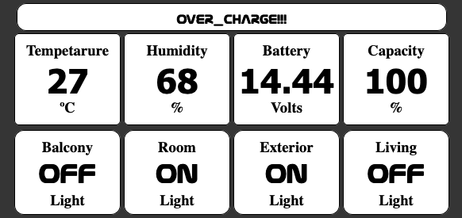

# Proyecto Domótica - Control y Monitoreo de Hogar
/**/

Este proyecto implementa un sistema de domótica utilizando una placa de desarrollo Wemos D1 (ESP8266) para controlar luces, sensar temperatura y humedad, medir corriente y voltaje, y monitorear el sistema de almacenamiento de energía. La interfaz de usuario está basada en web y permite controlar y visualizar el estado del sistema de forma local mediante una conexión WiFi.

## Características
- **Control de luces**: Permite encender y apagar luces de manera remota.
- **Sensado de temperatura y humedad**: Muestra en tiempo real la temperatura y humedad de las diferentes habitaciones o zonas mediante el sensor **DHT22**.
- **Medición de corriente**: Utiliza el sensor **ACS712** para medir el flujo de corriente en el sistema.
- **Medición de voltaje**: Mide el voltaje del sistema con el sensor **FZ0430**.
- **Monitoreo de energía**: Monitoreo del sistema de almacenamiento de energía (baterías, paneles solares, etc.).
- **Interfaz web local**: Control y visualización de datos mediante una interfaz web accesible dentro de la red WiFi.
- **Notificaciones y alertas**: Configuración de alertas para cambios significativos en temperatura, humedad o niveles de energía.

## Hardware
- **Placa de desarrollo**: Wemos D1 (ESP8266)
- **Sensores**:
  - **DHT22** para temperatura y humedad.
  - **ACS712** para medición de corriente.
  - **FZ0430** para medición de voltaje.
- **Otros**: Relés para el control de luces, módulo de monitoreo de energía, etc.

## Software
El software está basado en el entorno de desarrollo **Arduino IDE** y utiliza la librería ESP8266 para la comunicación a través de WiFi.

- **Lenguaje**: C/C++
- **Librerías**:
  - `ESP8266HTTPClient.h` - Para realizar solicitudes HTTP desde el ESP8266.
  - `ESP8266WiFi.h` - Para gestionar la conexión WiFi.
  - `WiFiClientSecure.h` - Para establecer conexiones seguras utilizando SSL/TLS.
  - `SimpleDHT.h` - Para trabajar con el sensor **DHT22**.
  - `ESPAsyncTCP.h` - Para gestionar comunicaciones TCP asincrónicas.
  - `ESPAsyncWebServer.h` - Para crear un servidor web asincrónico.
  - `ArduinoJson.h` - Para manejar objetos JSON en el proyecto.

## Instalación
1. Clona este repositorio.
2. Abre el proyecto en el **Arduino IDE**.
3. Asegúrate de tener instalada la placa **Wemos D1 (ESP8266)** en tu entorno de desarrollo.
4. Configura tu red WiFi en el código (modifica el archivo `meRED.h` para poner tu SSID y contraseña).
5. Conecta los sensores a los pines correspondientes de la placa:
   - **DHT22**: [Ver código](DomoHomeCode/SENS.h).
   - **ACS712**: [Ver código](DomoHomeCode/DomoHome.ino).
   - **FZ0430**: [Ver código](DomoHomeCode/SENS.h).
6. Instala las librerías necesarias:
   - **ESP8266HTTPClient**
   - **ESP8266WiFi**
   - **WiFiClientSecure**
   - **SimpleDHT**
   - **ESPAsyncTCP**
   - **ESPAsyncWebServer**
   - **ArduinoJson**
   
   Puedes instalar las librerías desde el Administrador de Librerías de Arduino IDE o agregándolas manualmente.
7. Carga el código a tu placa Wemos D1 utilizando el IDE de Arduino.

## Uso
1. Conecta el dispositivo a tu red WiFi.
2. Accede a la interfaz web abriendo el navegador y escribiendo la dirección IP del Wemos D1 en la barra de direcciones (puedes encontrar la IP en el monitor serie del IDE de Arduino).
3. Controla las luces, visualiza los datos de temperatura, humedad, corriente y voltaje, y monitorea el sistema de almacenamiento de energía desde la interfaz web.

## Contribuciones
Las contribuciones son bienvenidas. Si deseas mejorar el proyecto o añadir nuevas características, por favor realiza un fork y abre un pull request.

## Licencia
Este proyecto está bajo la Licencia MIT - consulta el archivo [LICENSE](LICENSE.md) para más detalles.
